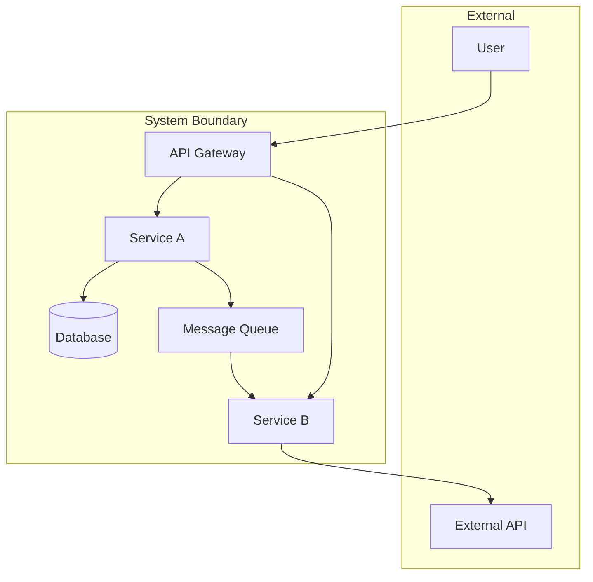

# Skill: Generate Architecture Diagram

## Agent
it-architect

## Description
Generate a C4 or component diagram in Mermaid format to visualize system architecture.

## Trigger
When a visual representation of system components is needed.

## Input
- System or component to diagram
- Level of detail (context, container, component)
- Specific focus areas (optional)

## Output
A Mermaid diagram with explanation.

## Example Output

## Guidelines
- Use clear, descriptive labels
- Show data flow direction
- Group related components
- Include external dependencies
- Add notes for complex interactions
